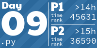
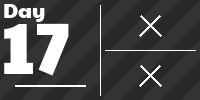

# adventOfCode2022

<!-- AOC TILES BEGIN -->

<!-- AOC TILES END -->

My solutions to advent of code problems.

Most days have the following:
* a numbered *.py file, the equivalent of 'main' for that day.
* a numbered *_input.txt file containing the sample input for that day.
* a numbered *_test.txt file, containing test input for the day.

Example files:
* 1.py - main for day 1.
* 1_test.txt - test input for day 1.
* 1_input.txt - input for day 1.
